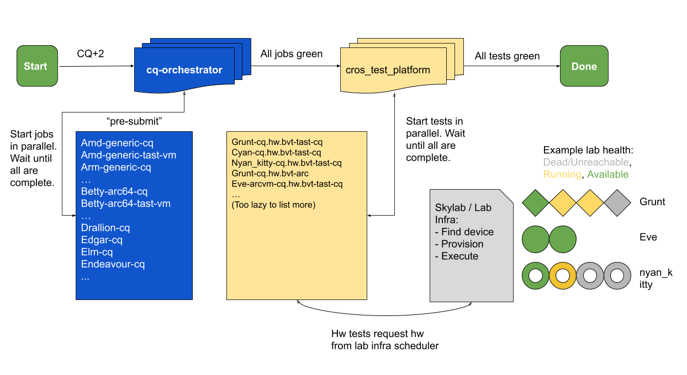

# Life of a Chrome OS commit

[TOC]

This document provides a brief overview of how Chrome OS changes get committed
and tested.

For details on **Chrome** changes, see
[Life of a Chrome commit on Chrome OS](chrome_commit_pipeline.md).

## Create a Chrome OS change

### Make and upload changes

See the [developer guide] for how to create a branch and make changes.

Once a change is completed and tested locally, upload it to [chromium-review]:

```repo upload --current-branch .```

### Have your change reviewed

Use [chromium-review] to review your change and prepare it for the commit queue.

See the [gerrit workflow] for details.

## The Chrome OS commit pipeline

As of January 2020, Chrome OS is using the parallel CQ. The documentation has
been updated to reflect how that behaves.

A gross simplification of the Chrome OS CI looks like this:


The CQ collects all changes in the patch series, along with any changes linked
via Cq-Depend in the commit messages, and applies them to tip of tree (ToT). The
result is then built and tested by the `cq-orchestrator`.

The cq-orchestrator starts jobs to compile and unit test your changes across
a variety of boards. All of the jobs run in parallel and the cq-orchestator will
collect all the results. If there are failures, the cq-orchestrator is a good
place to start debugging what went wrong.

Once all the builds are done, the cq-orchestrator kicks off
`cros_test_platform` which kicks off all the hardware tests. Tests run by
*cros_test_platform* require hardware resources and they will request this from
the lab infrastructure that is currently in place (Skylab as of Jan 2020). If
the hardware resource needed by the test isn't available, the test will wait for
it to become available or timeout after several hours.

To get additional help debugging issues with CQ you can ask for help in the
Sheriffs' chat channel. This is currently available at [go/cros-oncall].

### Dry-run

Once a change is marked CQ+1, the CQ will trigger a dry-run. The dry-run will
trigger the cq-orchestrator and it will only run the compile + unit test tasks.
The hardware tests will not be run.

### The Commit-Queue

When a change is marked verified, approved and marked Commit-Queue ready, it
will be sent to the commit queue.

It will follow the procedure described above, compiling the code, running unit
tests and running hardware tests.

### Post-submit builders

[Post-submit builders] are triggered roughly every 7-10 hours. It will run on
the same subset of boards that CQ builders run. Chrome OS sheriffs monitor these
builders to catch any regressions that made it through CQ.

### The Release (Canary) Builders

The ToT (canary) **[release]** builders are triggered automatically according
to a schedule, currently 3 times per day. The release builders will run on all
boards (not just a subset) and so may catch issues that may be missed by the
post-submit builders.

When you view [goldeneye], the builds and test results you see are from the
release builders.

### Simple Chrome

[Simple Chrome] is intended to provide developers with a reasonably stable
Chrome OS environment for Chrome development.

It uses the results of the [Chrome LKGM] builder to identify a recent stable
canary build (generally the most recent).


[chromium-review]: https://chromium-review.googlesource.com
[developer guide]: developer_guide.md
[gerrit workflow]: https://chromium.googlesource.com/chromiumos/docs/+/master/contributing.md#Going-through-review
[go/cros-oncall]: https://goto.corp.google.com/cros-oncall
[release]: https://cros-goldeneye.corp.google.com/chromeos/legoland/builderSummary?builderGroups=release&buildBranch=master
[goldeneye]: https://goto.corp.google.com/goldeneye
[Post-submit builders]: https://ci.chromium.org/p/chromeos/g/chromeos.postsubmit/builders
[Simple Chrome]: simple_chrome_workflow.md
[Chrome LKGM]: https://yaqs.googleplex.com/eng/q/5254238507106304
