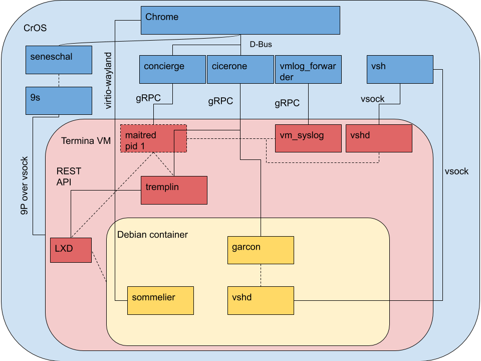

# Crostini developer guide

If you just want to use Linux (Beta), you should read the [Running Custom
Containers Under Chrome OS](containers_and_vms.md) doc. This doc is all about
how the crostini is made, not how to use it. :)

[TOC]

## What is all this stuff?

Note: this diagram is not exhaustive, but covers the major services and how they
interact.



Googlers: update this image at [go/termina-rpc]

## Where does the code live? {#repo-table}

| Name                                   | Affects                  | Repo                                 | ebuild                                                                                           |
|----------------------------------------|--------------------------|--------------------------------------|--------------------------------------------------------------------------------------------------|
| 9s                                     | Host                     | [platform2/vm_tools/9s]              | dev-rust/9s                                                                                      |
| chunnel                                | Host, Termina            | [platform2/vm_tools/chunnel]         | chromeos-base/chunnel, chromeos-base/termina_container_tools                                     |
| cicerone                               | Host                     | [platform2/vm_tools/cicerone]        | chromeos-base/vm_host_tools                                                                      |
| concierge                              | Host                     | [platform2/vm_tools/concierge]       | chromeos-base/vm_host_tools                                                                      |
| container .debs, Termina build scripts | Container                | [platform/container-guest-tools]     | N/A                                                                                              |
| crostini_client                        | Host                     | [platform2/vm_tools/crostini_client] | chromeos-base/crostini_client                                                                    |
| [crosvm]                               | Host                     | [platform/crosvm]                    | chromeos-base/crosvm                                                                             |
| [garcon]                               | Termina, Container       | [platform2/vm_tools/garcon]          | chromeos-base/vm_guest_tools, chromeos-base/termina_container_tools                              |
| LXD                                    | Termina                  | [github/lxc/lxd]                     | app-emulation/lxd                                                                                |
| maitred                                | Termina                  | [platform2/vm_tools/maitred]         | chromeos-base/vm_guest_tools                                                                     |
| [seneschal]                            | Host                     | [platform2/vm_tools/seneschal]       | chromeos-base/vm_host_tools                                                                      |
| [sommelier]                            | Termina, Container       | [platform2/vm_tools/sommelier]       | chromeos-base/sommelier, chromeos-base/termina_container_tools                                   |
| system_api                             | Host                     | [platform2/system_api]               | chromeos-base/system_api                                                                         |
| [tremplin]                             | Termina                  | [platform/tremplin]                  | chromeos-base/tremplin                                                                           |
| VM protobufs                           | Host, Termina, Container | [platform2/vm_tools/proto]           | chromeos-base/vm_protos                                                                          |
| vm_syslog                              | Host, Termina            | [platform2/vm_tools/syslog]          | chromeos-base/vm_guest_tools, chromeos-base/vm_host_tools                                        |
| [vsh]                                  | Host, Termina, Container | [platform2/vm_tools/vsh]             | chromeos-base/vm_host_tools, chromeos-base/vm_guest_tools, chromeos-base/termina_container_tools |

[crosvm]: https://chromium.googlesource.com/chromiumos/platform/crosvm/+/HEAD/README.md
[garcon]: https://chromium.googlesource.com/chromiumos/platform2/+/HEAD/vm_tools/garcon/README.md
[github/lxc/lxd]: https://github.com/lxc/lxd
[platform/container-guest-tools]: https://chromium.googlesource.com/chromiumos/containers/cros-container-guest-tools/
[platform/crosvm]: https://chromium.googlesource.com/chromiumos/platform/crosvm/
[platform/tremplin]: https://chromium.googlesource.com/chromiumos/platform/tremplin/
[platform2/system_api]: https://chromium.googlesource.com/chromiumos/platform2/+/HEAD/system_api
[platform2/vm_tools/9s]: https://chromium.googlesource.com/chromiumos/platform2/+/HEAD/vm_tools/9s
[platform2/vm_tools/chunnel]: https://chromium.googlesource.com/chromiumos/platform2/+/HEAD/vm_tools/chunnel
[platform2/vm_tools/cicerone]: https://chromium.googlesource.com/chromiumos/platform2/+/HEAD/vm_tools/cicerone
[platform2/vm_tools/concierge]: https://chromium.googlesource.com/chromiumos/platform2/+/HEAD/vm_tools/concierge
[platform2/vm_tools/crostini_client]: https://chromium.googlesource.com/chromiumos/platform2/+/HEAD/vm_tools/crostini_client
[platform2/vm_tools/garcon]: https://chromium.googlesource.com/chromiumos/platform2/+/HEAD/vm_tools/garcon
[platform2/vm_tools/maitred]: https://chromium.googlesource.com/chromiumos/platform2/+/HEAD/vm_tools/maitred
[platform2/vm_tools/proto]: https://chromium.googlesource.com/chromiumos/platform2/+/HEAD/vm_tools/proto
[platform2/vm_tools/seneschal]: https://chromium.googlesource.com/chromiumos/platform2/+/HEAD/vm_tools/seneschal
[platform2/vm_tools/sommelier]: https://chromium.googlesource.com/chromiumos/platform2/+/HEAD/vm_tools/sommelier
[platform2/vm_tools/syslog]: https://chromium.googlesource.com/chromiumos/platform2/+/HEAD/vm_tools/syslog
[platform2/vm_tools/vsh]: https://chromium.googlesource.com/chromiumos/platform2/+/HEAD/vm_tools/vsh
[seneschal]: https://chromium.googlesource.com/chromiumos/platform2/+/HEAD/vm_tools/seneschal/README.md
[sommelier]: https://chromium.googlesource.com/chromiumos/platform2/+/HEAD/vm_tools/sommelier/README.md
[tremplin]: https://chromium.googlesource.com/chromiumos/platform/tremplin/+/HEAD/README.md
[vsh]: https://chromium.googlesource.com/chromiumos/platform2/+/HEAD/vm_tools/vsh/README.md

## How do I build/deploy/test my change?

### General prerequisites

*   Follow the [Chromium OS Developer Guide](developer_guide.md) for setup.
*   Device with test image in developer mode.
*   TODO: how to deal with cros_debug mismatch?
*   TODO: Emerging tremplin etc. and directly mount it in vm_rootfs.img on the
    dut.

Ensure you are able to SSH to the device:

```bash
(inside) $ export DEVICE_IP=123.45.67.765 # insert your test device IP here
(inside) $ ssh ${DEVICE_IP} echo OK
```

For the rest of this document, it will be assumed that the `BOARD` environment
variable in `cros_sdk` is set to the board name of your test device as explained
in the [Select a board](developer_guide.md#Select-a-board)
section of the Chromium OS Developer Guide.

Crostini requires a signed-in, non-guest user account to run. You can either use
a test Google account, or run `/usr/local/autotest/bin/autologin.py -d` on a
test image to log in with a fake testuser profile.

### Host service changes

To begin working on a change to one of the host services (see
[Where does the code live?]), use the `cros_workon` command:

```bash
(inside) $ cros_workon --board=${BOARD} start ${PACKAGE_NAME}
```

Now that the package(s) are `cros_workon start`-ed, they will be built from
source instead of using binary prebuilts:

```bash
(inside) $ emerge-${BOARD} ${PACKAGE_NAME}
```

Then deploy the package to the device for testing:

```bash
(inside) $ cros deploy ${DEVICE_IP} ${PACKAGE_NAME}
```

Most VM services on the host have upstart conditions `start on started
vm_concierge` and `stop on stopped vm_concierge`. Since restarting only one
daemon could lead to inconsistent state across all services, it's best to shut
them all down, then start them again with a clean slate.
Stopping the `vm_concierge` service on the host stops all running VMs, along
other VM services on the host. Starting `vm_concierge` will trigger other
VM services to start as well.

```bash
(device) # stop vm_concierge && start vm_concierge
```

### Guest service changes

The guest packages that run inside the `termina` VM are built for two special
Chrome OS boards: `tatl` (for x86 devices) and `tael` (for arm devices).  These
VM images are distributed as part of the `cros-termina` component via the
browser’s Component Updater.

To determine the guest board type, run `uname -m` on the device.

| `uname -m` | termina board                        |
|------------|--------------------------------------|
| `x86_64`   | `(inside) $ export GUEST_BOARD=tatl` |
| `aarch64`  | `(inside) $ export GUEST_BOARD=tael` |

First, `cros_workon --board=${GUEST_BOARD} start` each guest package you are
modifying (see [Where does the code live?]):

```bash
(inside) $ cros_workon --board=${GUEST_BOARD} start ${PACKAGE_NAME}
```

Then, to build and deploy the updated packages to a device for testing, run this
command:

```bash
(inside) $ /mnt/host/source/src/platform/dev/contrib/deploy_termina -p -i -d ${DEVICE_IP}
```

The `deploy_termina` command above is recommended for new developers.  It
automatically determines the correct guest board for the device (`tatl` or
`tael`) by connecting to the device specified using `-d ${DEVICE_IP}` via SSH.
It then builds the full set of packages for the device (`-p`), builds the Chrome
OS rootfs image for the guest (`-i`), repacks the guest image into the layout
expected for the `cros-termina` component, copies it to the device, and restarts
the `vm_concierge` and `vm_cicerone` services on the device (stopping any
running VMs in the process).

> **WARNING**: The `/run/imageloader` directory that holds the Termina image is
> a `tmpfs`, so changes are *not* persisted across reboots. You will need to
> either run the `deploy_termina` script again, or manually mount the Termina
> image into the `/run/imageloader/cros-termina/99999.0.0` directory.

After `deploy_termina` completes, newly-launched VMs will use the testing
component with the updated packages.

### Container changes

Packages can end up in the container by two mechanisms:

1.  Native Debian packages (.debs) are preinstalled in the container, and
    upgraded out-of-band from the rest of Chrome OS by [APT].

2.  Packages built from Portage in Chrome OS are copied into
    `/opt/google/cros-containers` in Termina by the `termina_container_tools`
    ebuild. These are updated with the Termina VM image.

When working on Debian packages, the .debs should be copied to the crostini
container and installed with `apt:`

```bash
# A leading "./" or other unambiguous path is needed to install a local .deb.
(penguin) $ apt install ./foo.deb
```

Portage-managed packages should be treated like other [Guest service changes].
However, the `termina_container_tools` package is not `cros_workon`, so it
must be manually emerged to propagate changes into
`/opt/google/cros-containers`. The following example uses `sommelier`:

```bash
(inside) $ emerge-${GUEST_BOARD} sommelier               # build for Termina
(inside) $ emerge-${GUEST_BOARD} termina_container_tools # copy into /opt
```

Once `termina_container_tools` is manually rebuilt, the `deploy_termina` flow
will work as normal.

[APT]: https://en.wikipedia.org/wiki/APT_(software)
[go/termina-rpc]: http://go/termina-rpc
[Where does the code live?]: #repo-table
