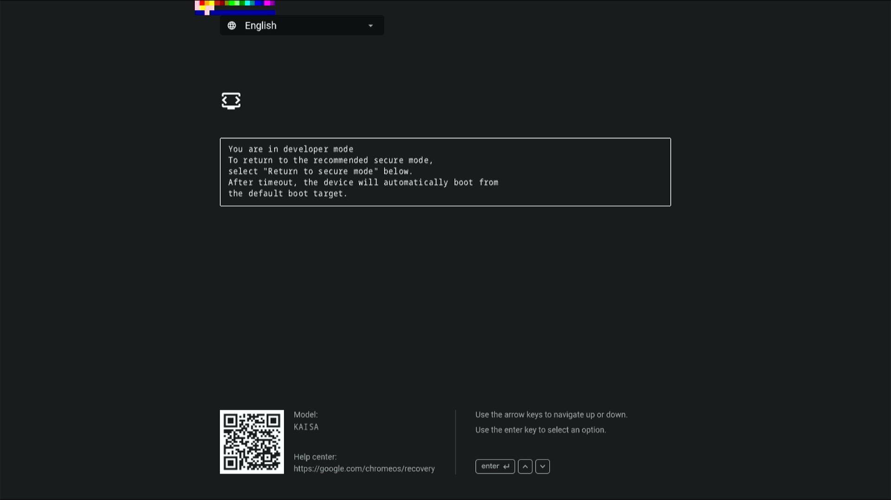

# Firmware UI troubleshooting

## Failed to emerge chromeos-bootimage

```
chromeos-bootimage-0.0.3-r80:  * ERROR: sys-boot/chromeos-bootimage-0.0.3-r80::chromiumos failed (compile phase):
chromeos-bootimage-0.0.3-r80:  *   Failed cbfstool invocation: cbfstool halvor/image-halvor.dev.bin add-payload -f /build/volteer/firmware/volteer/depthcharge/dev.elf -n fallback/payload -c lzma
chromeos-bootimage-0.0.3-r80:  * E: Could not add [/build/volteer/firmware/volteer/depthcharge/dev.elf, 111696 bytes (109 KB)@0x0]; too big?
chromeos-bootimage-0.0.3-r80:  * E: Failed to add '/build/volteer/firmware/volteer/depthcharge/dev.elf' into ROM image.
chromeos-bootimage-0.0.3-r80:  * E: Failed while operating on 'COREBOOT' region!
```

When failing to add either `locale_*.bin` or `depthcharge/dev.elf` into AP
image, it usually means the COREBOOT region in RO (check your chromeos.fmd) is
too small to contain all the necessary files.

**Solution 1 (preferred)**: Enlarge RO space in FMAP layout. See
[example CL](https://review.coreboot.org/c/coreboot/+/44362) for zork.

**Solution 2**: Try to decrease the `screen` or `text_colors` setting of your
board in [bmpblk/boards.yaml]. Note that this will lower the quality of text in
firmware screens (i.e. make it blurrier). The `text_colors` setting decides the
number of colors in BMP color table, which effectively translates to the amount
of anti-aliasing around the text edges. Please don't lower this value below 3
(since 2 means no anti-aliasing at all). The following message of
`chromeos-bootimage` may help you estimate the optimal setting.

```
* assets (RO): 2358 KiB (2820 KiB free) asurada
* assets (RW): 729 KiB (322 KiB free) asurada
```

See [example CL](https://crrev.com/c/2460988) for volteer.

## Blurry text in firmware screen

Blurry (or pixelated) text is usually caused by low resolution bitmaps generated
in bmpblk.

**Solution**: Try to increase the `screen` or `text_colors` setting of your
board in [bmpblk/boards.yaml]. Ideally the setting should match the physical
panel resolution, so that no scaling is needed at firmware UI runtime. However,
if the RO space is limited, try to specify the highest possible resolution that
will fit. See [example CL](https://crrev.com/c/2486675) for asurada.

## Fallback screen



### Fallback message

When failing to draw any part of the screen, fallback messages will be shown in
a textbox with monospaced font (similar to the debug info screen).

In this case, please check AP log to find out the failure triggering the
fallback message. Some common reasons are:
* Bitmap not found in RO CBFS: Please check if you have the latest code of
depthcharge and bmpblk, and make sure both ebuilds are built with the same USE
flags.
* Heap too small: Uncompressed bitmaps can take up to 3MiB heap space, depending
on the board settings. Insufficient heap size may lead to drawing failure for
some languages (since localized bitmaps are stored separately for each
language).

### Fallback colored stripes

In any case of drawing failure, 3 colored stripes will also be shown on the top
left corner of the screen to indicate the screen id and the currently selected
index. Please check [CL:2062723](https://crrev.com/c/2062723) for the meaning of
the stripes.

<!-- Links -->

[bmpblk/boards.yaml]: https://chromium.googlesource.com/chromiumos/platform/bmpblk/+/HEAD/boards.yaml
