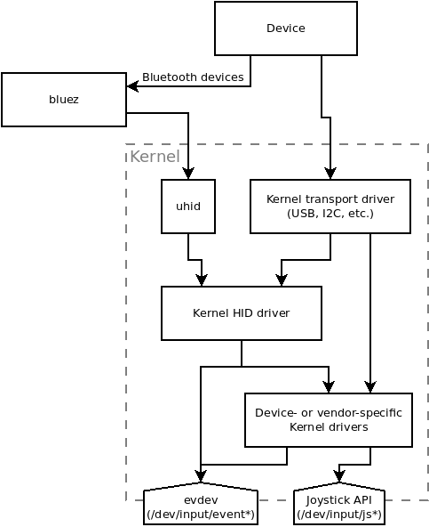
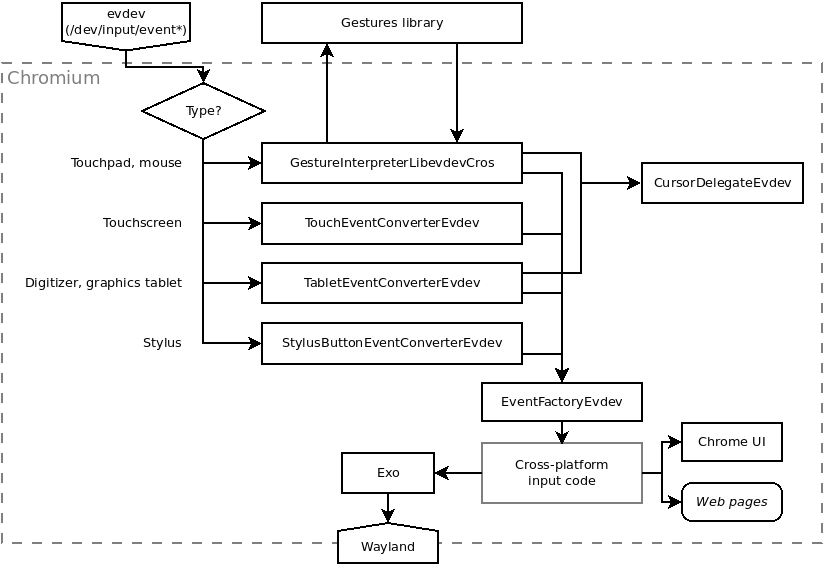
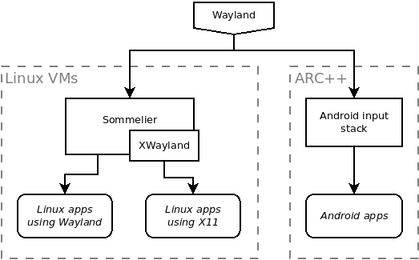

# Chromium OS Input Stack

This document summarises the Chromium OS input stack, from when events leave the
input device until the point where they enter Chromium's cross-platform code.
Each stage includes links to debugging tools, if available.

[TOC]

## Device to Chrome



### Transport

This is the method used to transfer data from the device to the CPU, to be read
by the Kernel.

#### I2C

I2C is the most common protocol used by input devices that are built into a
Chromebook (such as touchpads and touchscreens, as well as internal keyboards on
ARM). Typically the two-wire I2C bus is accompanied by a host interrupt line,
which the input device uses to inform the host when an event occurs. SparkFun
has [a good introduction to I2C](https://learn.sparkfun.com/tutorials/i2c/all).

**How to watch it:** either:

*   connect a logic analyser (like a [Saleae](https://saleae.com/)) or an
    oscilloscope to the wires, or
*   recompile the Kernel with `CONFIG_ENABLE_DEFAULT_TRACERS` enabled and use
    [the Kernel's I2C tracing][i2c-tracing].

[i2c-tracing]: https://linuxtv.org/wiki/index.php/Bus_snooping/sniffing#i2c

#### USB

Almost all wired external devices connect by USB. Many wireless devices also use
it by including a small USB dongle, which is treated exactly the same as a wired
USB device as far as we're concerned.

Although the vast majority of USB input devices are external, occasionally it'll
be used for a built-in device, such as the touchscreen on Karma (Acer Chromebase
CA24I2).

**How to watch it:**

*   Various pieces of hardware are available to capture and USB traffic, and
    logic analysers generally support it, too.
*   The [`usbmon` Kernel module][usbmon] can capture USB traffic without any
    special hardware. It produces text files that can then be parsed by various
    tools.
*   If the issue you're trying to debug can be reproduced on another platform,
    [Wireshark can capture USB](https://wiki.wireshark.org/CaptureSetup/USB).

[usbmon]: https://kernel.org/doc/Documentation/usb/usbmon.txt

#### Bluetooth

Many wireless devices connect this way, either using Bluetooth Classic or Low
Energy (BTLE). HID packets are sent to the Kernel by bluez through the uhid
interface.

**How to watch it:** use the `btmon` command, available on test images, to print
all Bluetooth traffic to the terminal.

#### AT Keyboard Interface

As the name suggests, this is used by the built-in keyboard on x86 Chromebooks.
(ARM Chromebooks use I2C instead.)

### In the Kernel

Once events are received by the Kernel, drivers decode them into one of two
output protocols, called evdev and joydev, which are consumed by userspace
(Chrome, in this case).

**Where to find logs:** run `dmesg` to print the contents of the Kernel log, or
`dmesg -w` to have it printed in real-time. (These work in Crosh, even without
developer mode enabled.) Useful messages to look out for include things like:

*   "input: Atmel MaXTouch Touchpad as
    /devices/pci0000:00/INT3432:00/i2c-0/i2c-ATML0000:01/input/input4", which
    occurs when a device is successfully registered, and
*   "hid-generic 0003:1A7C:0191.0005: input,hidraw0: USB HID v1.11 Mouse
    [Kingsis Peripherals Evoluent VerticalMouse 4] on
    usb-0000:00:14.0-2/input0", which occurs when a HID device is connected, and
    tells you what it's been identified as.

**Feedback reports** include the output of `dmesg`.

#### HID

Although it was originally created for USB, the HID protocol has become a
standard way of describing input devices and encoding events across a few
different transports, including I2C and Bluetooth. If a device uses HID, its
basic functionality generally works without a special Kernel driver (though one
is often provided to support more advanced features). [Frank Zhao's tutorial on
HID descriptors][hid-tutorial] is a good introduction to the protocol.

**How to watch it:** each HID device has a directory in sysfs, at
`/sys/kernel/debug/hid/<bus ID>:<vendor ID>:<product ID>.<a counter>`. (You can
find the bus, vendor, and product IDs on the "Input device ID" line output by
`evtest`.) In the directory is an `rdesc` file containing the descriptor in raw
and human-readable form, with a list of mappings applied by the Kernel at the
end. There's also an `events` file with the events being read from the device.

**Other useful tools:**

*   [hid-tools] is a set of Python scripts maintained by the Kernel input
    maintainers. They can record the descriptor and events produced by a HID
    device, then play it back later, which can be useful for testing. (In fact,
    the repository also includes a number of automated tests for the Kernel
    input subsystem.)
*   [The gamepad Tast tests][gamepad-tests] use the [uhid interface] and
    recordings from hid-tools to run end-to-end tests of almost the entire input
    stack, from HID going into Kernel drivers through to JavaScript events
    emerging from the Web Gamepad API. The same approach could be applied to
    other types of input devices, too.

[hid-tutorial]: https://eleccelerator.com/tutorial-about-usb-hid-report-descriptors/
[hid-tools]: https://gitlab.freedesktop.org/libevdev/hid-tools
[gamepad-tests]: https://chromium.googlesource.com/chromiumos/platform/tast-tests/+/HEAD/src/chromiumos/tast/local/bundles/cros/gamepad/
[uhid interface]: https://kernel.org/doc/Documentation/hid/uhid.txt

#### Drivers

Most device drivers read events from HID, but some read from the transport
directly. Examples of these include the `elants_i2c` driver for ELAN
touchscreens, `atkbd` (x86) or `cros_ec_keyb` (ARM) for internal keyboards, and
`xpad` for Xbox gamepads.

#### Kernel output protocols

##### evdev

Most drivers communicate input events to userspace using the evdev protocol.
Each device is represented by an `event` node in `/dev/input/`, which userspace
processes (in our case, Chrome) read from and make system calls on. As well as
encoding events, evdev specifies what type of events a device supports, so that
userspace can decide how to treat it. For full documentation, see the [Linux
Input Subsystem userspace API][evdev-docs] docs.

**How to watch it:** run `evtest` and choose a device from the list. This will
output the list of supported events for the device, and all the events from that
device as they come in. `evtest` is even available in Crosh on Chromebooks that
aren't in dev mode, but this version is filtered to remove potentially sensitive
data (such as the keys being pressed, or the amount of movement on an axis), so
it's less useful.

**Other useful tools:**

*   [Evemu](https://www.freedesktop.org/wiki/Evemu/) allows you to record and
    play back evdev traffic, using [uinput]. It should be pre-installed on test
    images. It has Python bindings, and an easy-to-analyse text-based format.

**Feedback reports** include recent evdev logs for touch and pointing devices.

[evdev-docs]: https://kernel.org/doc/html/latest/input/input_uapi.html
[uinput]: https://kernel.org/doc/html/v4.12/input/uinput.html

##### Joystick API, or joydev

The [Joystick API] predates evdev, and should have been succeeded by it, but
it's still used extensively by Chrome's gamepad support. Its devices are
represented by `js` nodes in `/dev/input/`. It's similar to evdev in many ways,
except that it doesn't identify the role of an axis or button, so userspace has
to maintain mappings for different gamepads.

**How to watch it:** run `jstest` with the path to the `js` node you want to
view.

[Joystick API]: https://kernel.org/doc/html/latest/input/joydev/joystick-api.html

## In Chrome



On Chrome OS, evdev is consumed by [Ozone], a part of Chrome which converts
evdev events into Chrome's cross-platform UI events. Ozone has a number of
converter classes, each of which handles a different type of input device.
`InputDeviceFactoryEvdev` decides which to use based on the axes and input
properties described by evdev, as follows:

*   `GestureInterpreterLibevdevCros` handles touchpads, mice, and other pointing
    devices (and is covered in more detail below);
*   `TouchEventConverterEvdev` handles touchscreens;
*   `TabletEventConverterEvdev` handles stylus-based input devices (like
    graphics tablets and the digitizers on many Chromebook touchscreens); and
*   `StylusButtonEventConverterEvdev` handles the buttons on styluses.

Most end up calling `EventFactoryEvdev` and possibly `CursorDelegateEvdev` with
the cross-platform events that they output, after which the events are handled
in mostly the same way as on any other platform.

**Where to find logs:** see [Chrome Logging on Chrome OS].

**Feedback reports** include the inputs and outputs of this stage for most types
of input devices. The easiest way to view these is to download the system logs
ZIP file for the report, then use [the Web version of the `mtedit`
tool][mtedit-web] from platform/mttools.

**Other useful tools:**

*   [Rick Byers paint example][rbyers-paint] and [Tracker with HUD][tracker-hud]
    are useful Web pages for looking at the touch screen events output by
    Chrome.
*   [Pointer Events][pointer-events] is a similar page for showing stylus
    events.

[Ozone]: https://chromium.googlesource.com/chromium/src.git/+/HEAD/docs/ozone_overview.md
[Chrome Logging on Chrome OS]: https://chromium.googlesource.com/chromium/src.git/+/HEAD/docs/chrome_os_logging.md
[mtedit-web]: https://adlr.info/mtedit-extension/mtedit.html
[rbyers-paint]: https://rbyers.github.io/paint.html
[tracker-hud]: https://patrickhlauke.github.io/touch/leapmotion/tracker/
[pointer-events]: https://patrickhlauke.github.io/touch/pen-tracker/

### `GestureInterpreterLibevdevCros` and the Gestures library

Touchpads, mice, trackballs, and pointing sticks are handled by
`GestureInterpreterLibevdevCros`, a wrapper around the Gestures library (found
in platform/gestures). The Gestures library filters the input (to detect palms,
for example) and identifies gestures made by the user (e.g. single-finger
pointer movement, two-finger scroll, pinch, etc.). It outputs a [`struct
gesture`][struct gesture] of the corresponding type, which
`GestureInterpreterLibevdevCros` converts to a Chrome event and dispatches.

Internally, the Gestures library is made up of a chain of "interpreters",
starting with a base interpreter, then including additional ones for things like
palm detection, split touch detection, and click wiggle removal. Different
chains are used for different types of device, and the chains are created [in
gestures.cc][interpreter-chains].

**How to watch it:** there are `DVLOG` statements for each gesture type in
`GestureInterpreterLibevdevCros`, which you can activate to show the gestures
being produced.

**Other useful tools:**

*   Much of the Gestures library's behaviour is configured using [Gesture
    Properties].  These can be changed at runtime using the `gesture_prop`
    command in Crosh, or even over D-Bus if you want to do it programmatically.
    You can also add your own gesture properties easily if you need to expose a
    parameter for faster debugging.
*   platform/touchpad-tests contains regression tests for all sorts of
    scenarios, checking the output of the Gestures library given certain inputs.
    Despite the name, it's also used for a few mice.
*   platform/mttools contains tools for analysing feedback reports, including
    `mtedit` (the online version of which is mentioned above). Not all of them
    are currently in working order.

[struct gesture]: https://source.chromium.org/chromiumos/chromiumos/codesearch/+/HEAD:src/platform/gestures/include/gestures.h?q=%22struct%20gesture%22&ss=chromiumos
[interpreter-chains]: https://source.chromium.org/chromiumos/chromiumos/codesearch/+/HEAD:src/platform/gestures/src/gestures.cc?q=InitializeTouchpad
[Gesture Properties]: https://chromium.googlesource.com/chromiumos/platform/gestures/+/HEAD/docs/gesture_properties.md

## Chrome to other apps



### Linux apps (Crostini)

When a Linux app is run on Chrome OS, input events are forwarded to it over the
Wayland protocol. You can read more about Wayland in the [Wayland Book]. A
Chrome component called [Exo] (or Exosphere) acts as the Wayland server, and
[Sommelier] is the compositor (running within the VM). If the app in question
actually uses the X11 protocol, Sommelier uses [XWayland] for translation.

**How to watch it:** you can see the events being sent to an application by
running it within Sommelier from your Linux VM terminal, and setting the
`WAYLAND_DEBUG` environment variable. For example, `sgt-untangle` (from the
`sgt-puzzles` package) is a nice app to play around with in this case:

```
$ WAYLAND_DEBUG=1 sommelier sgt-untangle
```

That’ll give you a lot of output as you move the mouse and type, so you probably
want to filter it. For example, to only show pointer events:

```
$ WAYLAND_DEBUG=1 sommelier sgt-untangle 2>&1 | grep wl_pointer
```

If the app only works with X11, add the `-X` switch before the name:

```
$ WAYLAND_DEBUG=1 sommelier -X xeyes
```

### Android apps (ARC++)

ARC++, the container in which Android apps run, also receives input events from
[Exo] over Wayland. These events are then translated into Android input events.

[Wayland Book]: https://wayland-book.com/
[Exo]: https://chromium.googlesource.com/chromium/src/+/HEAD/components/exo
[Sommelier]: https://chromium.googlesource.com/chromiumos/platform2/+/HEAD/vm_tools/sommelier/README.md
[XWayland]: https://wayland.freedesktop.org/xserver.html
