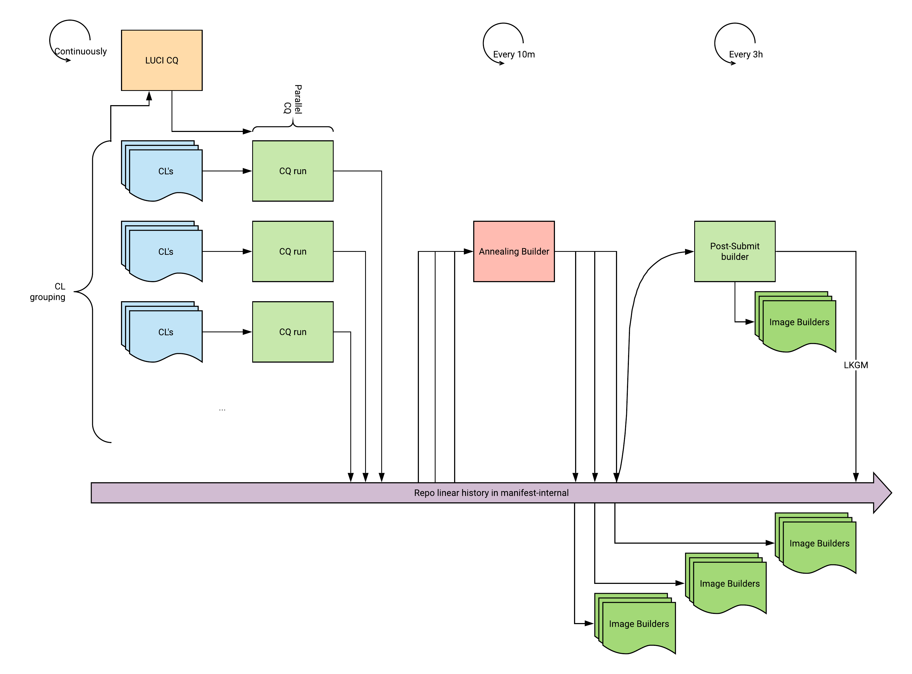
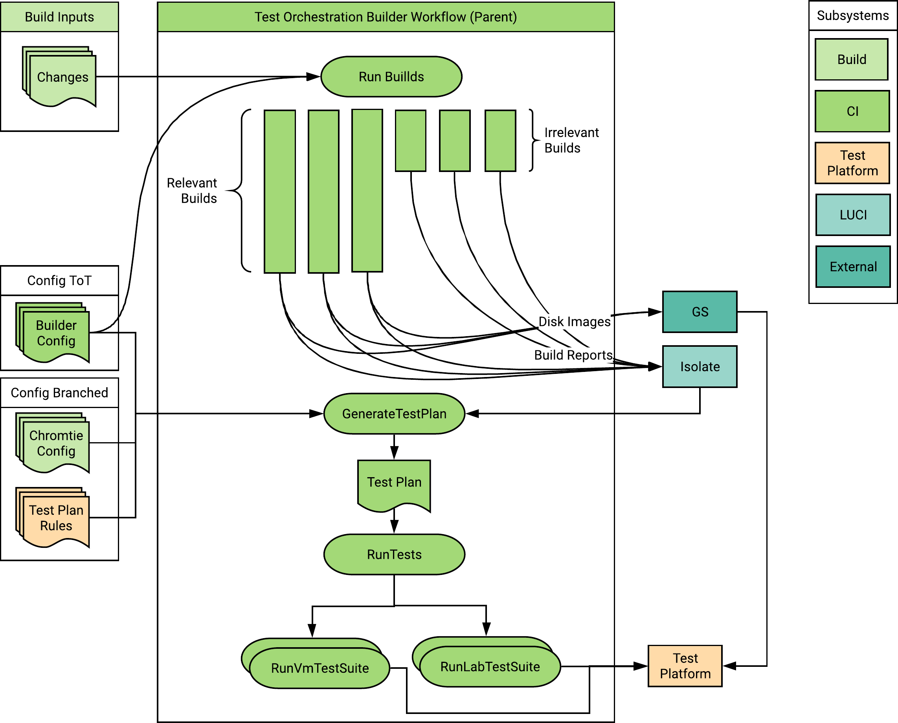
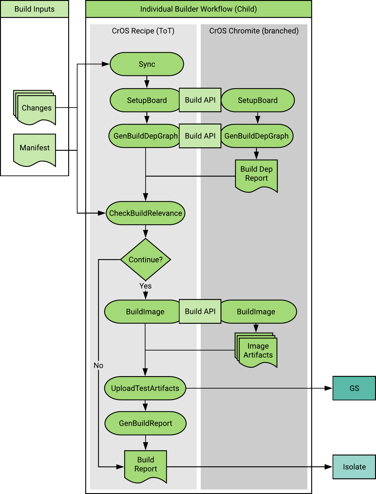
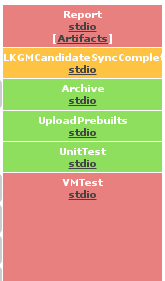
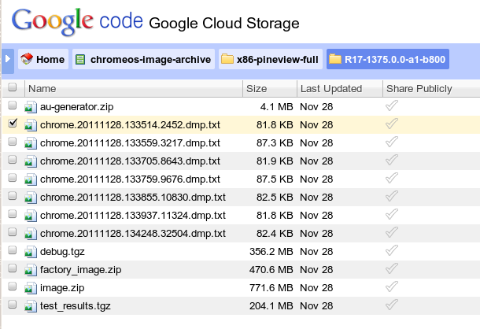

# Sheriff FAQ: Chromium OS

The [thesis on Sheriffing].

[TOC]

## The purpose of sheriffing

These threefold purposes apply to sheriffs

1.  Make sure tip-of-tree (ToT) breakages are identified and addressed in a
    timely fashion.

1.  Manually watch over our build system in ways automation doesn't/can't do.

1.  Give developers a chance to learn a little more about how build works and
    breaks.

In exchange for the above, sheriffs are granted Code Review +2 access to the
ChromeOS tree. Sheriffing is an important responsibility and fulfilling the
responsibility grants you CR+2 access.

## The sheriff's primary focus is the postsubmit builders

There are many CQ's running at the same time. The CQ's are the concern of the CL
authors. Every 30 minutes, a builder called [Annealing] takes a snapshot
of the tree and uprevs packages. Then, the [postsubmit builder] takes the most
recent of these (every 7-10 hours) and runs builds and hardware tests. There are
also snapshot builds launched at a higher frequency which may show tip-of-tree
build breakages more quickly as they're launched and complete at a more rapid
cadence. **As a sheriff, the only thing that you are concerned about is the
status of the tip-of-tree as shown by the postsubmit\snapshots as tracked in
Sheriff-o-Matic (see below). By fixing the tip-of-tree, you unblock CQ runs that
are running from the same broken state of the tree.** The secondary sheriff will
be watching the tip-of-tree release builders, and some, but not all issues
will manifest there as well see the [secondary sheriff] doc. The older release
builds are watched by the release owner TPMs.

This diagram attempts to capture this at an abstract level:



## The expectations on a sheriff

1.  **Do not leave the tree unattended**; coordinate with your secondary sheriff
    to ensure this. If you need to step out for a few hours, make sure that your
    secondary is covering for you. Normal work hours (for you) only.
1. **Watch** [Sheriff-o-Matic for ChromeOS]
   1.  **Keep this user interface open during your entire shift.**
   1.  **File or locate bugs.** File new bugs, or update existing ones. You can
       file a bug from the UI: group alerts with a similar root cause, then
       click the "File a Bug" link at the top. Include links in the
       bug. **Important:** bugs should be routed to the right component for the
       breakage or flake!  Raise priority as needed. See [this video] for a demo.
   1.  See the [SoM help page] for additional help.
1.  **Find owners for bugs that break our builds.** It's not the Sheriff's job
    to fix things, only to find the right person.
1.  **File bugs for test flakes that fail builds.** This is how we get
    build/infrastructure/test flake fixed, so it stops happening. Identify
    existing bugs where you can, or file new ones.
1.  **Identify confusing output.** If something about the waterfall or build
    results don't make sense, file a bug.
1.  When a specific builder is in a very bad state that cannot be corrected
    immediately, **mark the builder non-critical**. This will allow CQ runs that
    have the same build or hardware test failure to pass.
    1.  Refer to [go/cros-noncritical]
    1.  When the bug is resolved and the builder is stable, move it back to the
        critical list.
1.  While the tree is green, work on [sheriffing hotlist bugs] -- not your
    normal work items.

### Secondary sheriff

1.  Watch release builders and branches ([internal doc here]).
1.  Step in to replace the sheriff when they're unavailable.

### Sheriff and Gardener calendars

*   [East Calendar] (APAC)
*   [West Calendar] (Americas, EMEA)
*   [Gardeners Calendar]
*   [Shadow Gardeners Calendar]

To add calendar entries to your own @google.com calendar, follow directions at
[go/oncall2calendar].


### How do I join or leave the rotation?

*    [East Rotation]
*    [West Rotation]

Gardeners are added and removed from a Ganpati group ([Gardeners group], [Shadow
Gardeners group]) by managers.

### How do I swap with someone else?

To swap rotations now, all that need be done is to manually edit the g3 oncall
file and put the username of the person taking your shift where yours
occurs. These direct links will open an editor for you to make the change,
immediately:

*   [Swap for east rotation]
*   [Swap for west rotation]
*   [Swap for Gardeners]
*   [Swap for Shadow Gardeners]

## What should I do when I report for duty?

At the beginning of your stint as Sheriff, please perform the following tasks:

1.  Join the [CrOS Oncall] Hangouts Chat room and introduce yourself as an on-duty
    sheriff.
1.  Pull up the [Sheriff-o-Matic for ChromeOS] interface.
1.  Triage any failures. You are responsible for identifying issues that need
    attention and finding someone to pay attention to them. Fixing issues
    yourself is secondary.
1.  Attend the Monday weekly handoff meeting. You will have received an invite
    to this weekly meeting where sheriffs from the previous week provide a
    handoff on current issues.

## What should I do as I prepare to end my shift?

At the end of your stint as Sheriff, please attend the following week's Monday
handoff meeting.

## How do postsubmit and CQ builders work?

In the diagram above, there's a purple arrow that proceeds off to the
right. This represents the progress of the manifest-internal repository over
time (as repos in the ChromeOS forest progress). The Annealing builder makes
snapshots of this progress and CQ and postsubmit builders run with one of these
snapshots as their base commit. For postsubmit, it just always uses the most
recent snapshot. For CQ runs, it uses one of the most recent snapshot as its
base but then also cherry-picks the CL's under test into itself. In both CQ and
postsubmit, the whole build is controlled by a parent builder called
**Orchestrator**. This builder is responsible for starting child builders to
produce OS test images and then, later, scheduling hardware and VM testing. This
is represented by this diagram:



In the diagram above, the Orchestrator creates the child builders to create all
OS images. Some of those builders analyze the patched in changes (in CQ only)
and decide that they do not have the change in their Portage graph; these are
the Irrelevant Builds. For the remaining Relevant Builds, they upload their
finished OS test images to Google Storage. Their build process looks something
like this simplified diagram:




When the Orchestrator notices that all child builds have been completed, it will
schedule all hardware testing and VM testings at once. The Orchestrator will
wait for up to 20 hours for hardware test capacity in the lab to become
available. In most cases, the wait isn't this long.

Finally, when everything is done, the exit status (success/failure) of the
Orchestrator is based on whether or not the builds, HW tests, and VM tests all
succeeded.


## What is history-aware scheduling in CQ and how does it relate to sheriffing?

The CQ Orchestrator runs will only run those parts of the build that didn't
succeed last time. Thus, if a particular builder was broken and it is fixed in
ToT by the sheriff rolling back a breakage, the next time the user runs their
change through the CQ, the Orchestrator will skip everything that succeeded and
only run the failed bits.

## What are some related builders that I might hear about?

*   What is a Canary Build?
    *   An official build (with a unique version) is prepared and validated by
        canary builders a few times a day.
    *   The Canary Master decides success/failure for a given run. You mostly
        shouldn't look at slaves, except to see failure details. The Master
        should link to appropriate slaves.
*   What is ASAN bot?
    *   Please read [Sheriff FAQ: Chromium OS ASAN].
*   A toolchain builder is failing. What do I do?
    *   These builders test the next version of the toolchain and are being
        sheriff'd by the toolchain team. Not your problem.

## How do I deal with build failures?

When Sheriffs encounter build failures on the public Chromium OS builder, they
should follow the following process:

1.  See if you could fix it by reverting a recent patch
    *   If the build or test failure has a likely culprit, perform the revert and
        cc the author.
    *   Infrastructure build failure (repo sync hang, archive build failure,
        build_packages etc)?  Contact a [build deputy oncall]!
    *   For any other infrastructure failures, **contact a [Triage Oncall]**!
1.  Watch the next build to make sure it completes cleanly.
    *  Sheriffs are responsible for watching builds and making sure that people
       are working on making them green.
    *  If there's any red on the dashboard, the Sheriffs should be watching it
       closely to make sure that the issues are being fixed.  If there's not,
       the Sheriffs should be working to improve the sheriffability of the tree

## What bugs do I file, and how do I assign them?

*   If a test fails, or a specific component fails to compile, file a bug
    against that component normally. Assign it to an owner for that component.
*   If you believe there's an issue with the builder infrastructure, contact the
    oncall as above or file a bug at [go/cros-triage-bug].
*   If you believe there's an issue with the lab or hardware test
    infrastructure, you can file a bug following the instructions at
    [go/chromeos-lab-bug]

## Ahh, the tree is green.  I can go back to my work, right?

Wrong!  When the tree is green, it's a great time to start investigating and
fixing all the niggling things that make it hard to sheriff the tree.

*   Is there some red-herring of an error message?  Grep the source tree to find
    out where it's coming from and make it go away.
*   Some nice-to-have piece of info to surface in the UI?  Talk to
    [Infrastructure Deputy] and figure out how to make that happen.
*   Some test that you wish was written and run in suite:smoke?  Go write it!
*   Has the tree been red a lot today?  Get started on your [postmortem]!
*   Still looking for stuff to do?  Try flipping through the [Gardening Tasks].
    Feel free to hack on and take any of them!
*   Run across a build-related term or acronym and didn't know what it meant?
    Check the [glossary] and add it if it's missing.

## What should I do if I see a commit-queue run that I know is doomed?

If there is a commit queue run that is known to be doomed due to a bad CL and
you know which CL is bad, you can manually blame the bad CL to spare the
innocent CLs from being rejected. Go to the Gerrit review page of the bad CL and
set verify to -1. CQ will recognize the gesture and reject only the bad CL(s).

If the commit queue run has encountered infrastructure flake and is doomed, most
of the time CQ will not reject any CLs (with chromite CLs being the exception).

In other cases where it is not necessary to wait for the full results of the
run, you can save developer time and hassle by [aborting the current CQ run].

## How do I deal with a broken Chrome?

If a bug in Chrome does not get caught by PUpr CQ run, you should first **engage
with the Chrome gardener**.  They are responsible for helping to find and fix or
revert the Chrome change that caused the problem.

If the Chrome bug is serious enough to be causing failures on the canaries or
the CQ, you should work with the gardener to revert the Chrome uprev:

*   Make sure there's a bug filed for the problem you're dealing with. **Be sure
    to cc the gardeners**. You'll need the bug number for the next step; call it
    `$BUG`.
*   Ask the gardener to revert the chrome uprev according to their instructions
    in the guide: [go/cros-gardening]

## How can I revert a commit?

If you've found a commit that broke the build, you can revert it using these
steps:

*   Find the Gerrit link for the change in question
    *   [Gerrit lists recently merged changes]. View the change in question.
    *   In some cases (like the PFQ), you can see links to the CL that made it
        into the build straight from the waterfall.
*   Click the “Revert Change” button and fill in the dialog box.
    *   The dialog box includes some stock info, but you should add on to
        it. E.g. append a sentence such as: This broke the tree (xxx package on
        xxx bot).
*   You are not done.  This has created an Open change for _you_ go find and
    submit it.
    *   Add the author of the change as a reviewer of the revert, but push
        without an LGTM from the reviewer (just approve yourself and push).

## How do I bypass OWNERS enforcement to submit a fix urgently?

Add the line "Exempt-From-Owner-Approval:" to your commit message along with a
brief explanation of why you are bypassing OWNERS. Your CL will still require a
Code-Review +2 vote from someone other than yourself: Ask for a reviewer in
[CrOS Oncall] if you don't have someone handy.

## Help with specific failure categories

### How do I investigate VMTest failures?

There are several common reasons why the VMTests fail. First pull up the stdio
link for the VMTest stage, and then check for each of the possibilities below.

#### Auto-test test failed

Once you've got the VMTest stage's stdio output loaded, search for 'Total
PASS'. This will get you to the Autotest test summary. You'll see something like

```
Total PASS: 29/33 (87%)
```

Assuming the number is less than 100%, there was a failure in one of the
autotests. Scroll backwards from 'Total PASS' to identify the specific test (or
tests) that failed. You'll see something like this:

```
/tmp/cbuildbotXXXXXX/test_harness/all/SimpleTestUpdateAndVerify/<...>/login_CryptohomeMounted            [  FAILED  ]
/tmp/cbuildbotXXXXXX/test_harness/all/SimpleTestUpdateAndVerify/<...>/login_CryptohomeMounted              FAIL: Unhandled JSONInterfaceError: Automation call {'username': 'performancetestaccount@gmail.com', 'password': 'perfsmurf', 'command': 'Login'} received empty response.  Perhaps the browser crashed.
```

In this case Chrome failed to login for any of the 3 reasons: 1) could not find
network, 2) could not get online, 3) could not show webui login prompt. Look for
chrome log in /var/log/chrome/chrome, or find someone who works on UI.

(If you're annoyed by the long string before the test name, please consider
working on [crbug.com/313971], when you're gardening.)

#### Crash detected

Sometimes, all the tests will pass, but one or more processes crashed during the
test. Not all crashes are failures, as some tests are intended to test the crash
system. However, if a problematic crash is detected, the VMTest stdio output
will have something like this:

```
Crashes detected during testing:
----------------------------------------------------------
chrome sig 11
  login_CryptohomeMounted
```

If there is a crash, proceed to the next section, "How to find test
results/crash reports"?

#### ASAN error detected

The x86-generic-asan and amd64-generic-asan builders instrument some programs
(e.g. Chrome) with code to detect memory access errors. When an error is
detected, ASAN prints error information, and terminates the process. Similarly
to crashes, it is possible for all tests to pass even though a process
terminated.

If Chrome triggers an ASAN error report, you'll see the message "Asan crash
occurred. See asan\_logs in Artifacts". As suggested in that message, you should
download "asan\_logs". See the next section, "How to find test results/crash
reports" for details on how to download those logs.

Note: in addition to Chrome, several system daemons (e.g. shill) are built with
ASAN instrumentation. However, we don't yet bubble up those errors in the test
report. See [crbug.com/314678] if you're interested in fixing that.

#### ssh failed

The test framework needs to log in to the VM, in order to do things like execute
tests, and download log files. Sometimes, this fails. In these cases, we have no
logs to work from, so we need the VM disk image instead.

You'll know that you're in this case if you see messages like this:

```
Connection timed out during banner exchange
Connection timed out during banner exchange
Failed to connect to virtual machine, retrying ...
```

When this happens, look in the build report for "vm_disk" and "vm_image"
links. These should be right after the "stdio" link. For example, if you're
looking at the build report for "lumpy nightly chrome PFQ Build #3977" :

1.  VMTest (attempt 1) VMTest (attempt 1) ( 19 mins, 5 secs )
    1.  stdio
    1.  vm_disk: failed_SimpleTestUpdateAndVerify_1_update_chromiumos_qemu_disk.bin.8Fet3d.tar
    1.  vm_memory: failed_SimpleTestUpdateAndVerify_1_update_chromiumos_qemu_mem.bin.TgS3dn.tar
    1.  vm_test_results_1.tgz
1. VMTest (attempt 2) VMTest (attempt 2) ( 36 mins, 29 secs )
   1.  stdio
   1.  vm_disk: failed_SimpleTestUpdateAndVerify_1_update_chromiumos_qemu_disk.bin.uvzLqx.tar
   1.  vm_memory: failed_SimpleTestUpdateAndVerify_1_update_chromiumos_qemu_mem.bin.6lSD2q.tar
   1.  vm_test_results_2.tgz

Download the disk and memory images, and then resume the VM using kvm on your
workstation.

```
$ tar --use-compress-program=pbzip2 -xf \
    failed_SimpleTestUpdateAndVerify_1_update_chromiumos_qemu_disk.bin.8Fet3d.tar

$ tar --use-compress-program=pbzip2 -xf \
    failed_SimpleTestUpdateAndVerify_1_update_chromiumos_qemu_mem.bin.TgS3dn.tar

$ cros_start_vm \
    --image_path=chromiumos_qemu_disk.bin.8Fet3d \
    --mem_path=chromiumos_qemu_mem.bin.TgS3dn
```

You should now have a VM which has resumed at exactly the point where the test
framework determined that it could not connect.

Note that, at this time, we don't have an easy way to mount the VM filesystem,
without booting it. If you're interested in improving that, please see
[crbug.com/313484].)

For more information about troubleshooting VMs, see [how to run Chrome OS image
under VMs].

### How to find test results/crash reports?

The complete results from VMTest runs are available on googlestorage, by
clicking the [ Artifacts ] link in-line on the waterfall display in the report
section:



From there, you should see a file named chrome.*.dmp.txt that contains the crash
log. Example



If you see a stack trace here, search for issues with a similar call stack and
add the google storage link, or file a new issue.

### How do I extract stack traces manually?

Normally, you should never need to extract stack traces manually, because they
will be included in the Artifacts link, as described above. However, if you need
to, here's how:

1.  Download and extract the test\_results.tgz file from the artifact (above),
    and find the breakpad .dmp file.
1.  Find the build associated with your crash and download the file debug.tgz
    1.  Generally the debug.tgz in the artifacts should be sufficient
    1.  For official builds, see [go/chromeos-images]
    1.  TODO: examples of how to find this for cautotest and trybot(?) failures
1.  Untar (tar xzf) this in a directory under the chroot,
    e.g. ~/chromeos/src/scripts/debug
1.  From **inside the chroot**, run the following:
    `minidump_stackwalk [filename].dmp debug/breakpad > stack.txt 2>/dev/null`
1.  stack.txt should now contain a call stack!

If you successfully retrieve a stack trace, search for issues with a similar
call stack and add the google storage link, or file a new issue.  Note that in
addition to breakpad dmp files, the test_results.tgz also has raw linux core
files. These can be loaded into gdb and can often produce better stack traces
than minidump_stackwalk (eg. expanding all inlined frames).

### A builder appears to be down (purple). What do I do?

Probably nothing. Most of the time, when a child builder is purple, that just
indicates that it is already tracked by the CI oncaller. Try pinging the CI
oncaller on go/crosoncall.

### platform_ToolchainOptions autotest is failing. What do I do?

This test searches through all ELF binaries on the image and identifies binaries
that have not been compiled with the correct hardened flags.

To find out what test is failing and how, look at the *.DEBUG log in your
autotest directory. Do a grep -A10 FAILED *.DEBUG. You will find something like
this:

```
05/08 09:23:33 DEBUG|platform_T:0083| Test Executable Stack 2 failures, 1 in whitelist, 1 in filtered, 0 new passes FAILED:
/opt/google/chrome/pepper/libnetflixplugin2.so
05/08 09:23:33 ERROR|platform_T:0250| Test Executable Stack 1 failures
FAILED:
/path/to/binary
```

This means that the test called "Executable Stack" reported 2 failures, there is
one entry in the whitelist of this test, and after filtering the failures
through the whitelist, there is still a file. The name of the file is
/path/to/binary.

The "new passes" indicate files that are in the whitelist but passed this time.

To find the owner who wrote this test, do a git blame on this file:
https://chromium.googlesource.com/chromiumos/third_party/autotest/+blame/master/client/site_tests/platform_ToolchainOptions/platform_ToolchainOptions.py
and grep for the test name ("Executable Stack" in this case).

Find the change that added the new binary that fails the test, or changed
compiler options for a package such that the test now fails, and revert it.
File an issue on the author with the failure log, and CC the owner of the test
(found by git blame above).

## Who should I contact regarding ARC++ issues?

Visit [go/arc++docs] and see the Contact Information section.

## What do I do when I see a NotEnoughDutsError?

When you see an error like:

```
NotEnoughDutsError: Not enough DUTs for board: <board>, pool: <pool>; required: 4, found: 3, suite: au, build: <build>
Will return from run_suite with status: INFRA_FAILURE
```

Contact the on duty Deputy to balance the pools, Sheriffs are responsible to
ensure that there aren't bad changes that continue to take out DUTs, however
Deputies are responsible for DUT allocation.

Other handy links to information:

*   [CrOS Sheriff Glossary] - a glossary of CrOS build terminology.  Don't know
    what a word means?  Check here.
*   [Cros-Sheriffing YAQ] - a Quora-like Q&A site monitored by a number of
    people with build clues.

[Annealing]: https://ci.chromium.org/p/chromeos/builders/annealing/Annealing
[CI oncall]: https://oncall.corp.google.com/chromeos-ci-eng
[Triage Oncall]: https://oncall.corp.google.com/chromeos-infra-triage
[CrOS Oncall]: https://goto.google.com/crosoncall
[CrOS Sheriff Glossary]: http://go/cros-sheriff-glossary
[Cros-Sheriffing YAQ]: https://yaqs.googleplex.com/eng/t/cros-sheriffing
[East Calendar]: https://oncall.corp.google.com/chromeos-sheriffs-east
[East Rotation]: https://sphinx.corp.google.com/sphinx/#accessChangeRequest:systemName=chromeos-sheriffs-non-pacific&selectedRole=chromeos-sheriffs-non-pacific
[Gardeners Calendar]: https://oncall.corp.google.com/chromeos-gardeners
[Gardeners group]: https://ganpati.corp.google.com/#Group_Info?name=chromeos-chrome-gardeners
[Gardening Tasks]: https://code.google.com/p/chromium/issues/list?can=2&q=label%3AGardening
[Gerrit lists recently merged changes]: https://chromium-review.googlesource.com/q/status:merged
[Infrastructure Deputy]: http://goto.google.com/cros-infra-deputy
[secondary sheriff]: https://goto.google.com/secondary-sheriff
[Shadow Gardeners Calendar]: https://oncall.corp.google.com/chromeos-shadow-gardeners
[Shadow Gardeners group]: https://ganpati.corp.google.com/#Group_Info?name=chromeos-chrome-shadow-gardeners
[Sheriff FAQ: Chromium OS ASAN]: https://sites.google.com/a/chromium.org/dev/developers/tree-sheriffs/sheriff-details-chromium-os/sheriff-faq-chromium-os-asan-bots
[Sheriff-o-Matic for ChromeOS]: https://sheriff-o-matic.appspot.com/chromeos
[SoM help page]: https://sheriff-o-matic.appspot.com/help-som
[Swap for Gardeners]: https://cs.corp.google.com/piper///depot/ops/data/mail/configs/oncall.chromeos-gardeners?edit=true
[Swap for Shadow Gardeners]: https://cs.corp.google.com/piper///depot/ops/data/mail/configs/oncall.chromeos-shadow-gardeners?edit=true
[Swap for east rotation]: https://cs.corp.google.com/piper///depot/ops/data/mail/configs/oncall.chromeos-sheriffs-east?edit=true
[Swap for west rotation]: https://cs.corp.google.com/piper///depot/ops/data/mail/configs/oncall.chromeos-sheriffs-west?edit=true
[West Calendar]: https://oncall.corp.google.com/chromeos-sheriffs-west
[West Rotation]: https://sphinx.corp.google.com/sphinx/#accessChangeRequest:systemName=chromeos-sheriffs-pacific&selectedRole=chromeos-sheriffs-pacific
[aborting the current CQ run]: https://sites.google.com/a/google.com/chromeos/for-team-members/infrastructure/chromeos-admin/manual-cq-intervention
[build deputy oncall]: http://oncall/chromeos-build-eng
[crbug.com/313484]: http://crbug.com/313484
[crbug.com/313971]: http://crbug.com/313971
[crbug.com/314678]: http://crbug.com/314678
[glossary]: http://go/cros-sheriff-glossary
[go/arc++docs]: http://go/arc++docs
[go/chromeos-images]: https://goto.google.com/chromeos-images
[go/chromeos-lab-bug]:  http://go/chromeos-lab-bug
[go/cros-ci-bug]: http://go/cros-ci-bug
[go/cros-triage-bug]: http://go/cros-triage-bug
[go/cros-gardening]: http://go/cros-gardening
[go/cros-noncritical]: https://goto.google.com/cros-noncritical
[go/oncall2calendar]: https://goto.google.com/oncall2calendar
[how to run Chrome OS image under VMs]: http://www.chromium.org/chromium-os/how-tos-and-troubleshooting/running-chromeos-image-under-virtual-machines
[internal doc here]: http://go/cros-secondary-sheriff
[postmortem]: https://sites.google.com/a/google.com/chromeos/resources/tree-closure-postmortems
[postsubmit builder]: https://ci.chromium.org/p/chromeos/g/chromeos.postsubmit/console?limit=50
[sheriffing hotlist bugs]: https://code.google.com/p/chromium/issues/list?can=2&q=label%3AHotlist-CrOS-Sheriffing
[thesis on Sheriffing]: https://sites.google.com/a/chromium.org/dev/developers/tree-sheriffs/sheriff-philosophy
[this video]: https://drive.google.com/file/d/1NtneYDXFiGP2QJstmMmL09B8HYPmi5Ko/preview
